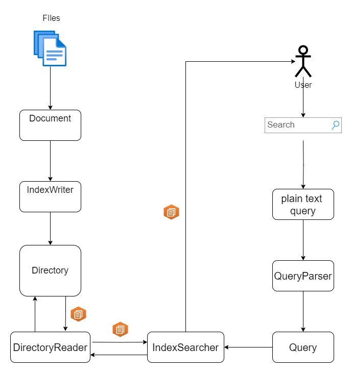

<h1>Searchio</h1>

<h1>About the project</h1>
This is a search engine application build to retrieve scientific articles. Users can enter   
keywords, authors, dates, etc. to get relevant results from a big database of scientific articles.  
The search engine is implemented using the Lucene library and JavaFX on the frontend view.

<h1>The Dataset</h1>
The project uses the  <a href = "https://www.kaggle.com/datasets/rowhitswami/nips-papers-1987-2019-updated/data?select=papers.csv"> "All NeurIPS (NIPS) Papers" </a> dataset. It consists   
of <b>9680</b> unique articles on the topic of <b>Neural Information Processing Systems</b>. Each dataset entry contains a year of publication, title, author details, abstracts and full text.  
These fields will be used to better determine the preferred articles to present to the user based on their search.

<h1>Search Engine Design</h1>

<h2>Visual aspects, UI and UX</h2>
The application consists of a main window frame. Within the windows exists a query input text field accompanied by  
a search button. While the user types their query, some recommended autocompletions will be displayed  
below the text field. The user can select any of them to automatically search for some results.

Upon committing the 
search input, the window is refreshed and results are rendered one under the other, while the query remains in the search bar.  
Each result consists of an article title Label, followed by the post date of the article and a small summary of the article content.  
Results that have been revisited will have their title color darker, so that the user knows they've visited that  
article before.

By clicking on a desired result, the user is brought to a new tab where the full article is displayed. Any words or phrases in the article matching the search query will be  
underlined yellow color(marker). The user can search for other words or phrases in the file by clicking the "find in file" button.

<h2>Search Engine architecture</h2>

The application uses the <a href = "https://lucene.apache.org/">Apache Lucene library</a>. Lucene offers powerful indexing and search   
functionalities, along with features such as spell checking, hit highlighting, and sophisticated analysis/tokenization capabilities.  

To be make the files searchable by the user, we first need to convert them into a Lucene Documents. Each document consists of one or more fields.  
In this case, the Document fields are the articles <b>title, abstract, year of publication</b> and <b> full text</b>. To analyze the <b>full text</b> field, Lucene provides  
the <b>SimpleAnalyzer</b> which breaks down text into <u>tokens</u>.   

<h3>Files pre-processing</h3>

After analyzing each article, we pass to the <b>Indexing</b> phase. The Index stores statistics of each Document ot make searching more efficient.  
To do so, we initialize a new <b>IndexWriter</b>, to which we provide an index directory (<b>Directory</b>) and an index configuration (<b>IndexWriterConfig</b>).  
The index directory is the place we want to store our index, which can be the disk (<b>FSDirectory</b>) or the RAM (<b>ByteBuffersDirectory</b>).  
Once the index is ready we add all the Documents to it with the <b>addDocument()</b> method. Each document added is analyzed by the analyzer defined in the
index configuration.  
  
  
<h3>File searching</h3>
By having an Index present in the application we can now search for results in our dataset. Once the user has typed their question, it needs to be converted into an actual   
query. Lucene provides the <b>Query</b> and <b>QueryParser</b> classes for this exact task. The QueryParser needs to be provided with the field of the document we want to base our search on. We also need to provide the analyzer.  
Then, a Query object created by calling the QueryParser.parse(" ") method with the plain text question as a parameter.  

For the purpose of advanced searching, such as searching by title, author, etc. we can use the <b>MultiFieldQueryParser</b> class. This class allows us to search for results based on multiple fields at once.

To search for answers to the query, we need to create a <b>DirectoryReader</b> and an <b>IndexSearcher</b>. We provide the reader with the path where the Directory is stored, then  
pass the reader to the IndexSearcher. The searcher is now ready it look for results in our dataset. We use the IndexSearcher.search(Query query) method to commit our query.
This will return a <b>TopDocs</b> object. A TopDocs contains a <b>hits</b> object with the number of hits, and a <b>ScoreDocs</b> array. Each ScoreDoc contains the documents index and its score.  
We can now iterate through the ScoreDocs array and retrieve the documents and their fields to return the to the user.  

  

